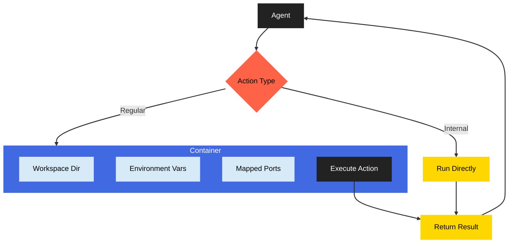

import { ZapIcon, TerminalIcon, ShieldCheckIcon, CogIcon } from 'lucide-react';
import { Callout } from 'fumadocs-ui/components/callout';

# Actions and Execution

Genbase Modules perform tasks by executing **Actions**. There are two primary types of Actions, differing significantly in how they are defined and executed:

1.  **Kit Actions:** Code defined within a **[Kit](/concepts/kits-registry)**, run in isolated Docker containers.
2.  **Internal Actions:** Methods defined directly within an **[Agent's](/concepts/profiles-agents)** Python class, run within the main Engine process.

## 1. Kit Actions <ZapIcon className="inline-block h-5 w-5 align-text-bottom" />

These represent reusable, potentially complex pieces of code logic packaged within a Kit.

*   **Purpose:** Encapsulate core operational logic tied to the Kit's capability (e.g., database operations, API calls, file processing). They are designed to be shareable and versioned with the Kit.
*   **Definition:**
    *   Written as Python functions in the Kit's `actions/` directory.
    *   Declared in `kit.yaml` under `profiles` or `provide`, including `name`, `path` (e.g., `check_connections`), and `description`.
*   **Metadata:** Function signatures/docstrings are parsed into an OpenAI-compatible schema for LLM understanding.
*   **Execution:** **Run securely in isolated Docker containers** managed by the `ActionService`.

### Secure Execution Environment <ShieldCheckIcon className="inline-block h-5 w-5 align-text-bottom" />

When an Agent invokes a Kit Action:

1.  **Image Preparation:** Genbase finds or builds a Docker image containing the Kit's specified base image and Python dependencies (`requirements.txt`). Images are cached for efficiency.
2.  **Container Launch:** A temporary container is started from this image.
3.  **Environment Setup:**
    *   The Module's environment variables are injected.
    *   The Module's [Workspace](/concepts/workspace-resources) (Git repo) is mounted read-write at `/repo`.
    *   The Kit's `actions/` directory is mounted read-only at `/actions`.
    *   Defined ports are mapped.
4.  **Execution:** The specified Python function is executed within the container.
5.  **Result Retrieval:** The return value (or error) is captured and sent back to the Agent.

*Diagram: Kit Action execution flow involving Docker isolation.*

<Callout title="Benefits of Kit Action Isolation" intent="info">
    *   **Security:** Protects the host and other Modules.
    *   **Reliability:** Prevents dependency conflicts.
    *   **Consistency:** Ensures predictable execution environment.
</Callout>

## 2. Internal Actions <CogIcon className="inline-block h-5 w-5 align-text-bottom" />

These are methods defined directly on the Agent class itself, often decorated or registered specifically to be callable like Actions.

*   **Purpose:** Provide functionality tightly coupled to the Agent's internal logic or state, often for simpler tasks that don't require external dependencies or heavy computation (e.g., modifying agent memory, formatting output, simple utility functions).
*   **Definition:**
    *   Implemented as methods within the Agent's Python class (inheriting from `BaseAgent`).
    *   Often marked with a decorator (like the `@action` decorator seen in `BaseAgent`'s code) or registered programmatically using the `InternalActionManager`.
*   **Metadata:** Similar to Kit Actions, metadata (parameters, description) is typically extracted from the method signature and docstring for the LLM.
*   **Execution:** **Run directly within the main Genbase Engine process** as part of the Agent's execution flow. They have access to the Agent's `self` instance and any services available to the Agent (like `self.utils`, `self.services`).

### Execution Flow

*Diagram: Internal Action execution flow (direct method call).*

<Callout title="Kit Actions vs. Internal Actions" intent="warn">
    *   **Use Kit Actions for:** Complex logic, external dependencies, accessing/modifying the Module workspace, potentially long-running tasks, security-sensitive operations, or reusable logic intended to be part of the Kit's defined capability.
    *   **Use Internal Actions for:** Simple utility functions internal to the agent, manipulating agent state/memory, interfacing with genbase,tasks that don't need strict isolation or external dependencies managed by the Kit.
    *   **Security:** Internal Actions run with the same permissions as the Engine process itself. Kit Actions are significantly more secure due to containerization.
</Callout>

Both types of Actions allow Agents to perform tasks beyond just generating text, but they serve different purposes and have distinct execution models and security implications. The `kit.yaml` only declares Kit Actions; Internal Actions are discovered from the Agent's code.
