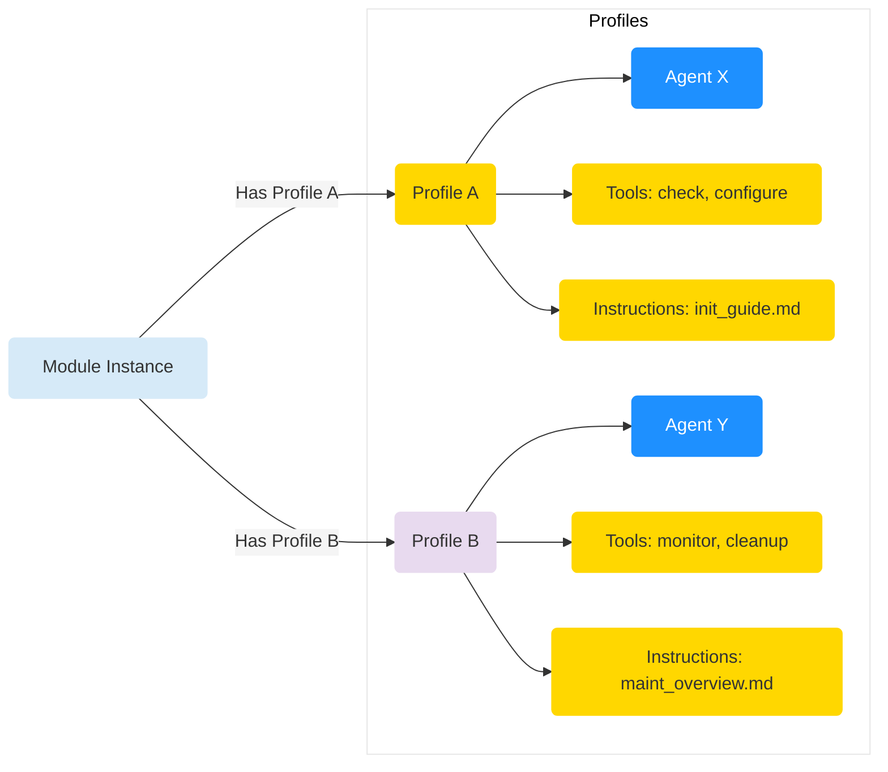
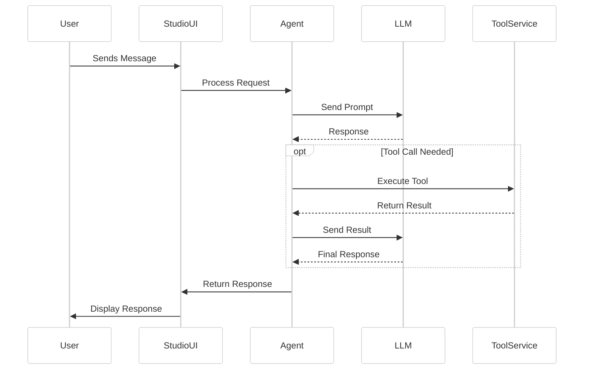

import { BotIcon, MessageSquareIcon, Settings2Icon } from 'lucide-react';
import { Callout } from 'fumadocs-ui/components/callout';

# Profiles and Agents

**Profiles** define *how* you interact with a **[Module](/concepts/projects-modules)**, while **Agents** are the engines that *drive* those interactions.

## Profiles <Settings2Icon className="inline-block h-5 w-5 align-text-bottom" />

A Profile is a specific **operational mode** or **workflow** exposed by a Module. Think of it as a specialized interface for a particular task.

*   **Purpose:** Offer distinct ways to use a Module's capabilities (e.g., setup vs. ongoing tasks).
*   **Defined In:** `kit.yaml` within the `profiles:` section.
*   **Specifies:**
    *   The **Agent** responsible.
    *   Available **Tools** for that mode.
    *   Contextual **Instructions**.
    *   If multiple chat **Sessions** are allowed (`allow_multiple`).

*Diagram: A Module can offer multiple Profiles, each linking to specific Agents, Tools, and Instructions.*

## Agents <BotIcon className="inline-block h-5 w-5 align-text-bottom" />

An Agent is the **intelligent controller** that executes the logic for a specific Profile. It uses LLMs and Tools to respond to user input within that Profile's context.

*   **Purpose:** Manage the conversation flow, interpret user requests, decide on tools (call LLM, run code), and generate responses.
*   **Implementation:** Python classes inheriting from `BaseAgent`. Can be custom-built within a Kit or use built-in Genbase agents (like `TaskerAgent`). ([Agent Development Guide](/kit-development/agents)).
*   **Key Tasks:**
    *   Process user input.
    *   Maintain chat history.
    *   Interact with the configured LLM (`ModelService`).
    *   Execute available Tools (`ToolService`).
    *   Access Module workspace (`AgentUtils`).
    *   Manage profile-specific data (`ProfileStoreService`).

## Chat Interaction & Sessions <MessageSquareIcon className="inline-block h-5 w-5 align-text-bottom" />

Users typically interact with a Module's Profile via a chat interface.

*Diagram: Simplified chat interaction flow involving the User, UI, Engine, Agent, LLM, and Tool Service.*

*   **Chat History:** All turns (user, assistant, tool calls, tool results) are stored per Module/Profile/Session.
*   **Sessions:** If a Profile has `allow_multiple: true`, users can have separate, parallel conversations within that single Profile, each with its own history.

<Callout title="Human-in-the-Loop">
Genbase Agents operate within the defined Profile scope, typically guided by user prompts and confirmations, rather than acting fully autonomously.
</Callout>

In short, **Profiles** define *what* a Module can do in a specific mode, and **Agents** define *how* it does it, orchestrating LLMs and code execution.