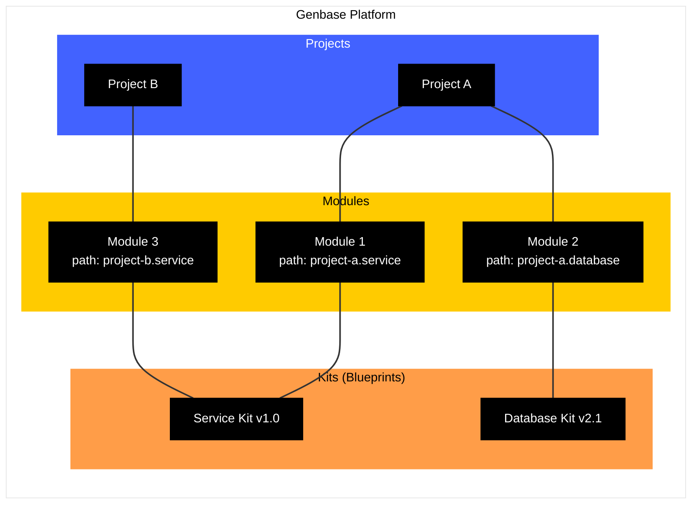

import { Callout } from 'fumadocs-ui/components/callout';
import { FolderGit2Icon, BlocksIcon, Image } from 'lucide-react';

# Projects, Modules, and Paths

Genbase uses a hierarchical structure to organize your work: **Projects** contain **Modules**, and Modules are instances of **Kits**. This structure helps manage complexity, provides context for interactions, and enables logical addressing within your AI systems.

## Projects <FolderGit2Icon className="inline-block h-5 w-5 align-text-bottom" />

A **Project** is the top-level organizational container in Genbase. Think of it as a workspace for a specific application, team, or major initiative. All the components related to that initiative typically reside within the same project.

*   **Purpose:** To group related Modules together logically and provide a scope for unique Module Paths.
*   **Identification:** Each project has a unique ID (UUID) and a unique Name.
*   **Default Project:** Genbase automatically creates a `default` project (`ID: 0000...`). If you don't explicitly create or select another project, new Modules will usually be associated with this one.
*   **Management:** You create and switch between projects using the Project Selector in the Genbase Studio sidebar or via the [Project API](/api-reference/projects).

## Modules <BlocksIcon className="inline-block h-5 w-5 align-text-bottom" />

A **Module** is a running, stateful instance of a specific **[Kit](/concepts/kits-registry)** version within a particular **Project**. It represents a deployed AI capability, configured and ready for interaction or collaboration.

*   **Purpose:** To execute the logic, manage the data (workspace), and utilize the resources defined in its parent Kit.
*   **Instantiation:** You create a Module by selecting a Kit and version. This process initializes the Module's dedicated workspace with the Kit's `workspace/` content and allows you to set initial environment variables. See [Creating Modules](/user-guide/modules/creating).
*   **Identification:** Each Module is uniquely identified by:
    *   A globally unique `module_id` (e.g., `able-aquamarine-ant`).
    *   A user-defined `module_name` for easier recognition.
    *   Its unique `path` *within its Project*.
*   **State:** Modules maintain their own state, independent of other Modules (even those from the same Kit):
    *   **Configuration:** Module-specific environment variables.
    *   **[Workspace](/concepts/workspace-resources):** A dedicated Git repository for files.
    *   **Interaction History:** Chat logs per profile/session.
    *   **Internal State:** Data in the Profile Store.
    *   **Status:** Operational state and profile completion.
*   **Interaction:** Modules are interacted with via their defined **[Profiles](/concepts/profiles-agents)**.

*(Image: Screenshot of the Genbase Studio showing the Project Selector dropdown and the Module Explorer tree, highlighting a selected module.)*

<Callout title="Module vs. Kit" intent="info">
    A **Kit** is like a class – a blueprint defining structure and potential behavior.
    A **Module** is like an object – a specific instance of that blueprint, with its own memory, configuration, and operational history. You can instantiate multiple Modules from the same Kit.
</Callout>

## Module Path

The **Module Path** is crucial for identifying and organizing Modules *within a Project*.

*   **Format:** Uses a dot-separated notation (e.g., `backend.services.auth`, `ui.components.login_form`). Segments must be alphanumeric (`a-z`, `A-Z`, `0-9`).
*   **Uniqueness:** Must be unique *within* its Project. Modules in different projects can share the same path structure (e.g., `ProjectA/db.main` and `ProjectB/db.main`).
*   **Purpose:**
    *   Provides a logical, human-readable address for the Module within the project hierarchy.
    *   Determines the visual structure in the Studio's Module Explorer tree.
    *   Can be used programmatically to reference modules when setting up relationships or resource provisions.
*   **Setting:** Defined during [module creation](/user-guide/modules/creating). Can be updated later via the API.

**Example Structure:**

Imagine a Project named "ECommerce Platform":

*   `frontend.storefront` (Module Name: Storefront UI, Kit: `react-app-builder` v1.2.0)
*   `backend.order_service` (Module Name: Order Service, Kit: `python-fastapi-service` v2.0.1)
*   `backend.product_catalog` (Module Name: Product Service, Kit: `python-fastapi-service` v2.0.1)
    *   *Note: Uses the same Kit as the order service, but is a separate instance managing product data.*
*   `database.main_postgres` (Module Name: Primary DB Manager, Kit: `postgres-manager` v1.5.0)
    *   *Note: A single module instance manages the database for users, products, orders, etc., as defined by the `postgres-manager` Kit.*
*   `services.email_notifications` (Module Name: Email Service, Kit: `sendgrid-mailer` v1.0.0)
*   `ops.deployment_pipeline` (Module Name: CI/CD Pipeline, Kit: `ci-cd-manager` v0.8.0)

This structure uses paths to logically group modules by function (frontend, backend, database, services, ops) while allowing reuse of Kits (like `python-fastapi-service`) for different functional Modules. The `postgres-manager` module centralizes database operations for various data types managed by the backend services.
