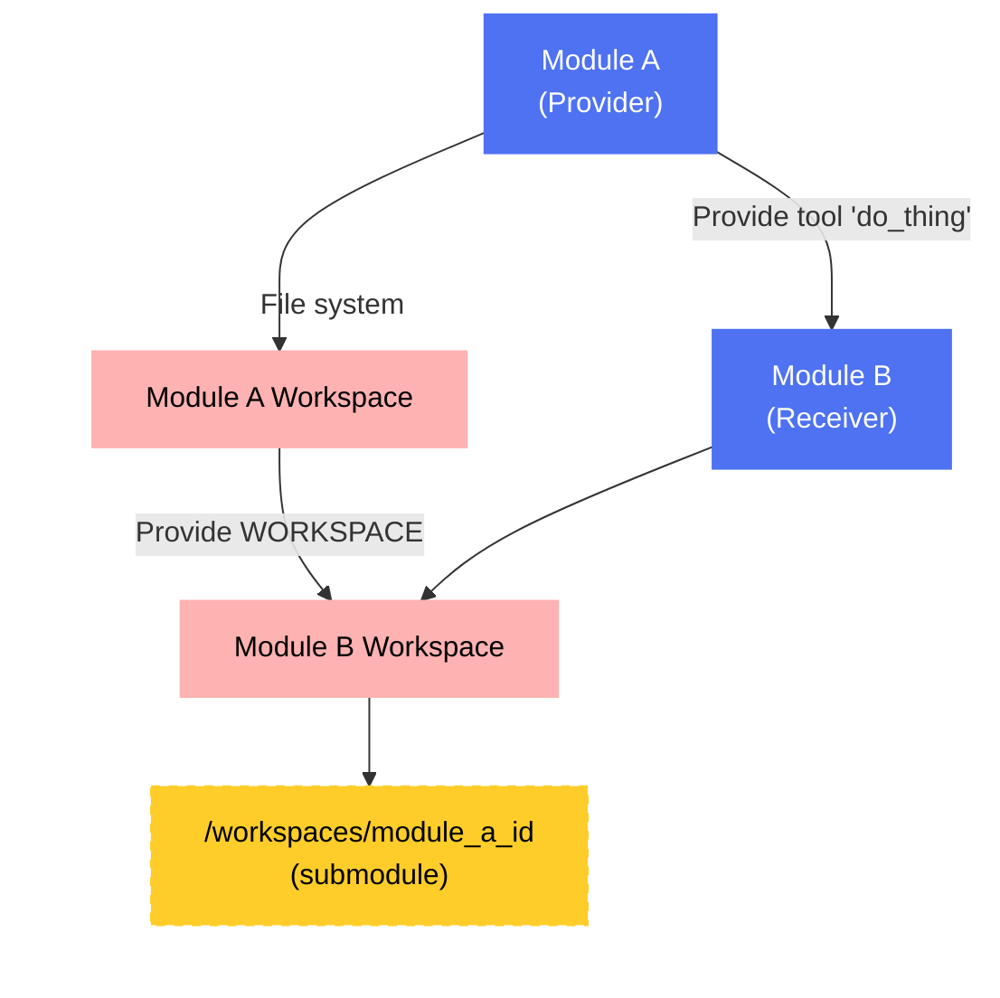

import { LinkIcon, PackageIcon, FolderGitIcon, Share2Icon } from 'lucide-react';
import { Callout } from 'fumadocs-ui/components/callout';

# Module Resource Sharing (Provide)

For **[Modules](/concepts/projects-modules)** to collaborate and build complex systems, they need ways to interact and share resources. Genbase primarily facilitates this through the **Provide** mechanism.

## The Provide Mechanism <Share2Icon className="inline-block h-5 w-5 align-text-bottom" />

The **Provide** system allows one Module (the *Provider*) to explicitly grant access to specific resources or capabilities to another Module (the *Receiver*). This creates a directed link and enables controlled sharing.

*   **Purpose:** To establish clear dependencies and enable secure, controlled sharing of functionality or data between Modules without tightly coupling their internal implementations.
*   **Definition:**
    *   What a Kit *can* provide is defined in the `provide` section of its `kit.yaml` file ([Kit YAML Reference](/kit-development/kit-yaml)). This declares the potential Tools, Instructions, or Workspace access it's willing to share.
    *   The *actual* link between two running Module instances is created via the API or the Studio UI ([Managing Provisions](/user-guide/modules/providing)). This creates a `ModuleProvide` record in the database.
*   **Granularity:** Sharing is defined per resource type (`ProvideType`).

## Resource Types <PackageIcon className="inline-block h-5 w-5 align-text-bottom" />

Modules can provide the following types of resources:

1.  **`TOOL`**
    *   **What it shares:** Specific executable functions (Kit Tools) defined in the *Provider* Kit's `provide.tools` section.
    *   **How it works:** When Module A provides an `TOOL` to Module B, the specified tools from Module A become available within the **[Agent](/concepts/profiles-agents)** context of Module B when it runs. Module B's agent can then invoke these tools as if they were its own.
    *   **Execution:** Importantly, when Module B invokes a provided Tool, the Tool code still executes securely within an isolated Docker container configured with the *Provider* Module's (Module A's) environment, dependencies, and workspace context. The Receiver (Module B) only gets the *result*.
    *   **Use Case:** Allowing one Module to leverage the specialized capabilities of another (e.g., a `WebSearch` Module providing a `search(query)` tool to a `ResearchAssistant` Module).

2.  **`WORKSPACE`** <FolderGitIcon className="inline-block h-5 w-5 align-text-bottom" />
    *   **What it shares:** Read-only access to the entire Git repository (Workspace) of the *Provider* Module.
    *   **How it works:** When Module A provides its `WORKSPACE` to Module B, Genbase automatically configures Module A's repository as a **Git submodule** within Module B's repository. It's typically mounted under a specific path like `workspaces/{provider_module_id}/` within Module B's workspace.
    *   **Access:** Tools executed by Module B can then *read* files from this mounted submodule path (`/repo/workspaces/{provider_module_id}/...`). They cannot directly write back to the provider's workspace.
    *   **Use Case:** Allowing one Module to analyze, read configuration from, or process data contained within another Module's workspace (e.g., a `CodeAnalyzer` Module reading code from a `WebAppBackend` Module's workspace; a `DocumentationGenerator` reading multiple provided workspaces).

*Diagram: Module A provides an Tool and its Workspace to Module B. Module B's Agent can call `do_thing` (executed in A's context), and its Tools can read from `/repo/workspaces/module_a_id`.*

## Managing Provisions

*   **Creation:** Links are established explicitly, usually via the Studio UI ([Managing Provisions](/user-guide/modules/providing)) or API. You select the Provider, Receiver, and Resource Type.
*   **Visibility:** The Studio UI allows viewing which resources a Module is providing and which it is receiving.
*   **Deletion:** Provisions can be removed. If a `WORKSPACE` provision is removed, the corresponding Git submodule should also be removed from the receiver's repository.

<Callout title="Security and Control">
The Provide mechanism ensures controlled sharing. A Module only gains access to what another Module explicitly provides, and the execution context (for Tools) remains tied to the Provider, enhancing security and encapsulation.
</Callout>

By defining what Kits *can* provide and then explicitly linking Module instances, Genbase enables the construction of complex, collaborative systems from independent, reusable components.
