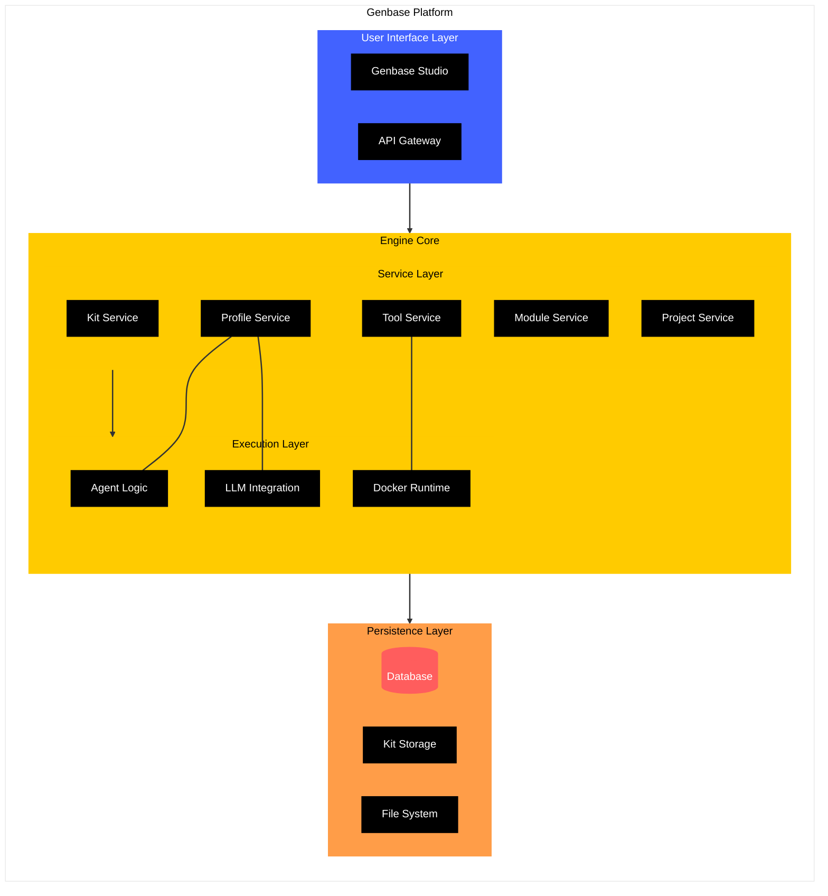

import { Cards, Card } from 'fumadocs-ui/components/card';
import { FileIcon, BlocksIcon, FolderGit2Icon, BotIcon, ZapIcon, LinkIcon, CombineIcon } from 'lucide-react';

# Welcome to Genbase

**Build, Orchestrate, and Share Powerful AI Agent Systems**

Genbase is a platform designed to help you create sophisticated, collaborative AI systems in a modular, reusable, and manageable way. Think of it as an operating system where specialized AI capabilities, packaged as "Kits," can be instantiated, connected, and orchestrated to tackle complex problems.

## Why Genbase?

Developing advanced AI applications often involves wrestling with complexity, integrating disparate components, managing dependencies, and ensuring secure execution. Genbase addresses these challenges by providing:

*   **Modularity & Reusability:** Package specific AI expertise, tools, and workflows into versioned **Kits** that can be shared and reused across projects.
*   **Structured Orchestration:** Instantiate Kits as **Modules** within organized **Projects**, defining clear relationships and controlled resource sharing between them.
*   **Secure & Isolated Execution:** Run Kit-defined **Tools** in sandboxed environments (Docker containers) with managed dependencies and configurations.
*   **Agentic Interaction:** Interact with Modules through defined **Profiles** managed by intelligent **Agents** capable of using LLMs and executing Tools.
*   **Human-in-the-Loop Focus:** Designed for human operators to manage, direct, and collaborate with AI agents via intuitive interfaces like the **Genbase Studio**.
*   **Ecosystem Potential:** Discover and leverage Kits from a central **Registry** (future) or share your own, fostering a collaborative development environment.

## Core Concepts

Understanding these fundamental building blocks is key to leveraging Genbase effectively.

<Cards>
  <Card
    href="/concepts/kits-registry"
    icon={<BlocksIcon />}
    title="Kits & Registry"
    description="Reusable blueprints containing AI capabilities, configurations, and code."
  />
  <Card
    href="/concepts/projects-modules"
    icon={<FolderGit2Icon />}
    title="Projects & Modules"
    description="Organize work into Projects and run Kit instances as stateful Modules."
  />
  <Card
    href="/concepts/profiles-agents"
    icon={<BotIcon />}
    title="Profiles & Agents"
    description="Define interaction modes (Profiles) handled by intelligent Agents."
  />
  <Card
    href="/concepts/tools-execution"
    icon={<ZapIcon />}
    title="Tools & Execution"
    description="Package and run executable code securely within isolated environments."
  />
  <Card
    href="/concepts/relationships-provide"
    icon={<LinkIcon />}
    title="Relationships & Provide"
    description="Connect Modules and enable controlled sharing of resources like Workspaces and Tools."
  />
    <Card
    href="/concepts/workspace-resources"
    icon={<CombineIcon />}
    title="Workspaces & Resources"
    description="Manage the file state (Workspace) and specific content items (Resources) of Modules."
  />
</Cards>

## Get Started

Ready to dive in?

<Cards>
  <Card
    href="/quick-start"
    icon={<FileIcon />}
    title="Quick Start"
    description="Get Genbase running locally using Docker in minutes."
  />
  <Card
    href="/user-guide"
    icon={<FileIcon />}
    title="User Guide"
    description="Learn how to use the Genbase Studio interface."
  />
   <Card
    href="/kit-development"
    icon={<FileIcon />}
    title="Kit Development"
    description="Learn how to create your own reusable Kits."
  />
</Cards>

---

*High-level Architecture:*

