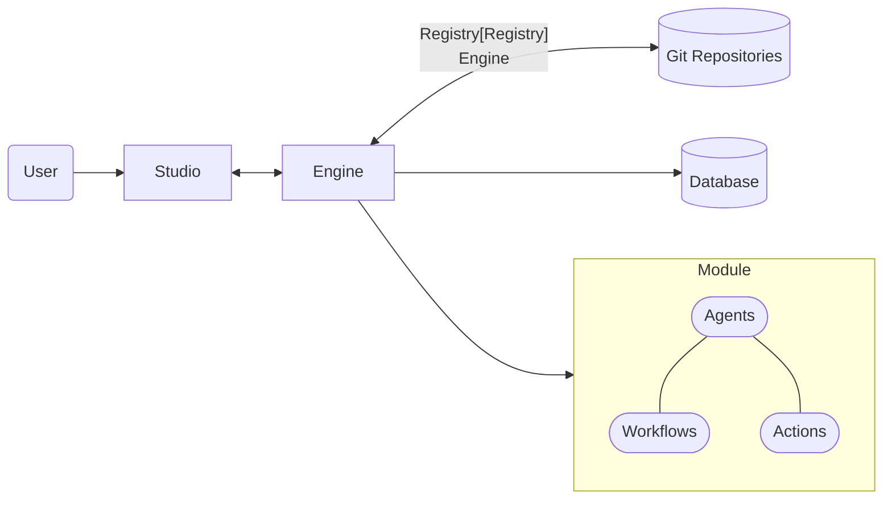
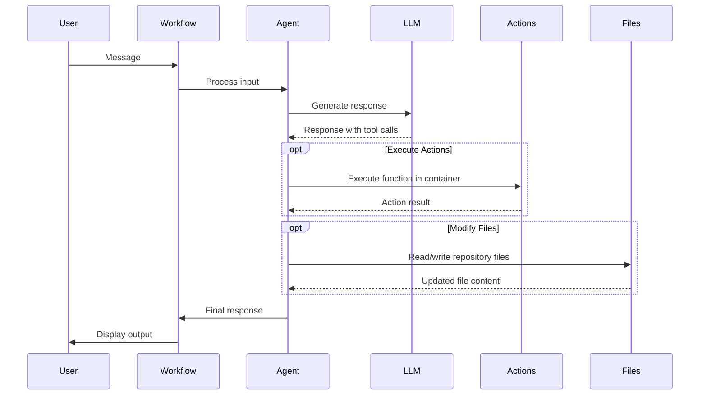
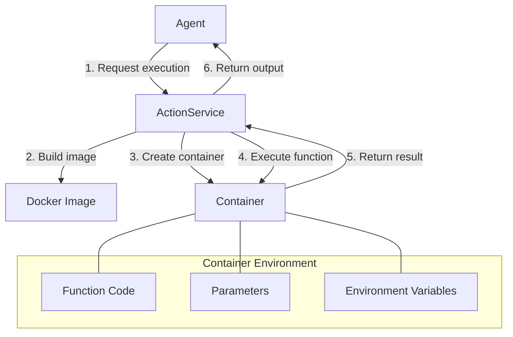
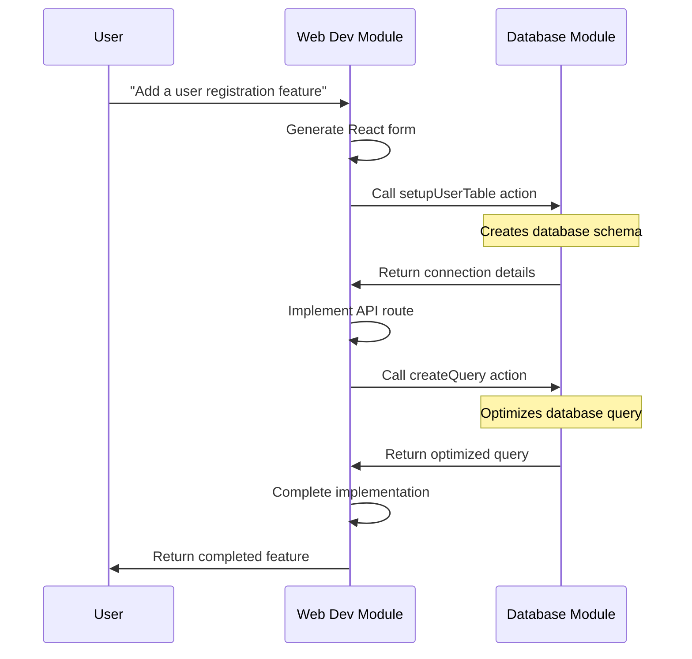

# Genbase Architecture

This document explains how Genbase's architecture enables specialized AI agents to collaborate effectively within a modular system.

## Core Architecture

Genbase is built around three key components that work together to create a modular AI collaboration platform:



- **Engine** - The core backend that manages modules, agents, workflows, and executes actions
- **Studio** - The UI where users interact with agents through purpose-built workflows
- **Registry** - The distribution hub for module kits (reusable module templates)

## How Genbase Works

### The Module System

Modules are the fundamental building blocks in Genbase. Each module:

- Contains specialized agents with deep domain knowledge
- Defines purpose-built workflows for different tasks
- Has its own Git repository for code and resources
- Can relate to other modules through well-defined relationships

> **Key Insight:** Instead of building one agent that knows everything but lacks depth, Genbase allows you to combine specialized modules that each excel in their domain.

When a module is created from a kit, it includes everything needed for a specific domain:

```
module/
├── agents/            # Agent implementation code
├── actions/           # Executable functions
├── instructions/      # Prompts and specifications
└── kit.yaml           # Module configuration
```

Each module operates within a Git repository workspace, giving agents the ability to access and modify files, track changes, and collaborate with other agents.

### Agent Intelligence Layer

Agents are the intelligent core of Genbase. Each agent:

1. **Receives instructions** from workflow definitions
2. **Communicates with LLMs** through the ModelService
3. **Manages chat history** through the ChatHistoryManager
4. **Executes actions** in isolated Docker containers
5. **Manipulates files** using AgentUtils

The `BaseAgent` class provides foundational capabilities for all agents and handles complex tasks like:

- Converting natural language to structured actions
- Persisting conversation context
- Interfacing with language models
- Executing functions securely



### Module Collaboration

What makes Genbase powerful is how modules interact through relations:

| Relation Type | Purpose | Example Use Case |
|--------------|---------|-----------------|
| **Action** | Allows one module to call functions from another | Web module calling database queries from a DB module |
| **Context** | Enables sharing context and knowledge between modules | AI testing module accessing code in web module |
| **Submodule** | One module includes another as a Git submodule | Deployment module including application module |

This approach enables specialized capability sharing. For example, a database module can expose optimized query functions that a web development module can use without needing to understand database internals.

## Technical Implementation

### Workflow Execution System

Workflows are executed through a chain of services:

1. **WorkflowService** receives user inputs and routes them to the appropriate agent
2. **BaseAgent** processes requests using the ModelService (LLM interface)
3. **ActionService** executes functions in isolated Docker containers
4. **RepoService** manages Git repositories for file operations

When an action is executed:

```bash
# Simplified execution flow
1. Agent identifies action to execute from LLM response
2. ActionService prepares Docker container with required dependencies
3. Function code is executed in isolated environment
4. Results are returned to agent
5. Agent incorporates results into conversation
```

### Docker-Based Action Execution

Actions are executed in Docker containers for security and reproducibility:



This containerization approach ensures:

- **Security** through isolation
- **Dependency management** for different modules
- **Reproducibility** of executions
- **Port management** for services that need networking

### Data Storage

Genbase uses multiple persistent storage mechanisms:

- **SQL Database** - Stores module metadata, relationships, and chat history
- **Git Repositories** - Store file content and track changes
- **Workflow Store** - Provides a document database-like interface for modules to store structured data

The `WorkflowStoreService` offers agents the ability to persist data with filtering and query capabilities, similar to a document database:

```python
# Example of how an agent might use workflow store
async def store_task(title, description, status):
    store = self.get_store("tasks")
    await store.set_value({
        "title": title,
        "description": description,
        "status": status,
        "created_at": datetime.now().isoformat()
    })

# Later retrieve tasks
async def get_open_tasks():
    store = self.get_store("tasks")
    filter = WorkflowStoreFilter(
        value_filters={"status": {"eq": "open"}},
        sort_by={"created_at": SortOrder.DESC}
    )
    return await store.find(filter)
```

## Key Components in Depth

### ModuleService

The `ModuleService` is the central coordinator that:

- Creates and manages modules
- Establishes relationships between modules
- Manages environment variables
- Integrates with other services

When modules need to collaborate, `ModuleService` verifies relationship permissions and facilitates the connection.

### Agent Implementation

Agents are implemented through a class hierarchy with `BaseAgent` providing core functionality. The actual implementation can vary by domain:

```python
class NextJSAgent(BaseAgent):
    @property
    def agent_type(self) -> str:
        return "nextjs"
        
    async def process_request(self, context, workflow_data, responses=None):
        # Specialized Next.js understanding and processing
        # ...
```

The `AgentLoader` dynamically loads these agent implementations from module kits, allowing for specialized behavior while maintaining a consistent interface.

### Workflow Definition

Workflows are defined in the module's `kit.yaml` file:

```yaml
workflows:
  develop:
    agent: "web-developer"
    instruction: "development.md"
    actions:
      - path: "nextjs:run_npm_script" 
        name: "npm_script"
        description: "Runs npm script - dev, build, etc."
      - path: "nextjs:install_npm_packages"
        name: "install_packages"
        description: "Installs npm packages"
```

This declarative approach makes it easy to define specialized workflows for different purposes, each with their own instructions and available actions.

## Real-World Example

Let's see how these components work together in a real-world scenario where a user is developing a web application with a database:



In this example:

1. The Web Dev module handles frontend and API implementation
2. The Database module provides specialized database capabilities
3. The modules collaborate through defined action relationships
4. Each module contributes deep expertise in its domain

This modular approach delivers results that combine specialized knowledge from both domains, without requiring either agent to be an expert in everything.

## Conclusion

Genbase's architecture is built around the principle that specialized domain expertise, properly composed, creates more powerful AI solutions than general-purpose assistants. By providing a structured way for modules to collaborate through well-defined relationships, Genbase enables complex workflows that would be difficult to achieve with a single AI assistant.

The combination of specialized agents, secure action execution, and Git-based workspaces creates a platform where AI modules can work together seamlessly, each operating in its area of strength while contributing to a unified solution.