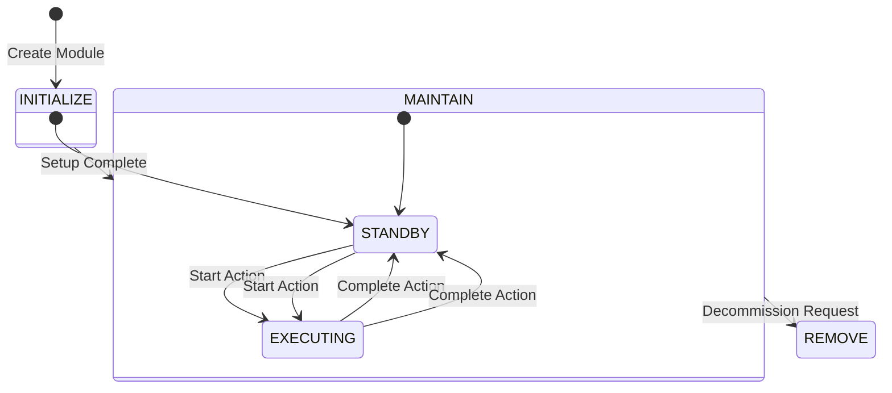
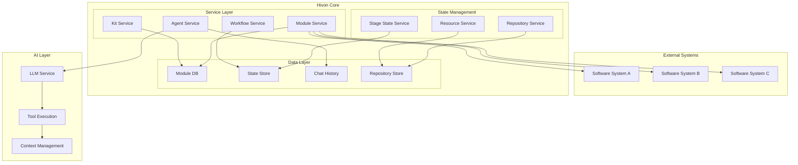

## Core Services

### Kit Service

The Kit Service manages the lifecycle of kit definitions and their versions. It provides core functionality for:

1. Version Management
```python
class KitService:
    def __init__(self, base_path: Path):
        self.base_path = base_path
        
    async def save_kit(self, kit_data: BinaryIO) -> KitMetadata:
        """
        Save a new kit version after validating its structure
        and extracting metadata from kit.yaml
        """
        # Implementation details from source code
```

2. Kit Validation
   - Semantic version validation
   - Structure verification
   - Dependency checking

3. Distribution
   - Version resolution
   - Dependency resolution
   - Content delivery

### Module Service

The Module Service is responsible for module lifecycle management and relationships:

```python
class ModuleService:
    def create_module(
        self,
        project_id: str,
        owner: str,
        kit_id: str,
        version: str,
        env_vars: Dict[str, str],
        path: str,
        module_name: Optional[str] = None
    ) -> ModuleMetadata:
        """Create a new module instance"""
        # Implementation details from source code
```

Key Responsibilities:
1. Module Creation
2. Relationship Management
3. State Tracking
4. Environment Configuration

### Agent Service

The Agent Service orchestrates AI agent interactions:

```python
class AgentService:
    async def execute_agent_workflow(
        self,
        module_id: str,
        workflow: str,
        user_input: str
    ) -> Dict[str, Any]:
        """Execute workflow with state management and error handling"""
        # Implementation details
```

Core Features:
1. Workflow Execution
2. Tool Management
3. Context Building
4. State Transitions

## State Management

### Stage State Service

Manages the progression of modules through different stages:



Implementation Details:
```python
class StageStateService:
    def promote_stage(self, module_id: str, target_stage: AgentStage):
        """
        Promote module to next stage if valid
        
        Args:
            module_id: Module identifier
            target_stage: Target stage to promote to
        """
        # Implementation details from source code
```

### Resource Service

Manages module resources and their lifecycle:

1. Resource Types
   - Instructions
   - Documentation
   - Specifications
   - Workspace files

2. Resource Management
```python
class ResourceService:
    def get_workspace_resources(self, module_id: str) -> List[Resource]:
        """Get workspace resources for a module"""
        # Implementation details
```


### State Store

The state store maintains:
1. Module Stage Information
2. Execution State
3. Workflow Progress
4. Relationship Status

## AI Integration

### LLM Service

The Language Model service provides:

```python
class ModelService:
    def __init__(self, model_name: str = "claude-3-5-sonnet-20240620"):
        self.model_name = model_name

    async def chat_completion(
        self,
        messages: List[Dict[str, str]],
        stream: bool = False,
        tools: Optional[List[Dict[str, Any]]] = None,
        tool_choice: Optional[Union[str, Dict[str, str]]] = None,
        **kwargs
    ):
        """Get chat completion from model"""
        # Implementation details from source code
```

### Tool Execution System

Tools are defined and executed through:

1. Function Definitions
```python
@dataclass
class FunctionMetadata:
    """Function metadata in OpenAI function calling format"""
    name: str
    description: str
    parameters: Dict[str, Any]
    is_async: bool
```

2. Execution Environment
```python
class ActionService:
    def execute_function(
        self,
        folder_path: str,
        file_path: str,
        function_name: str,
        parameters: Dict[str, Any],
        requirements: List[str],
        env_vars: Dict[str, str],
        repo_name: str
    ) -> Any:
        """Execute a function in the shared environment"""
        # Implementation details from source code
```

## Security Considerations

1. Environment Isolation
   - Each module runs in its own virtual environment
   - Strict dependency management
   - Resource limitations

2. Access Control
   - Module-level permissions
   - Action restrictions
   - Resource boundaries

3. Audit Trail
   - Comprehensive logging
   - Action history
   - State transitions

## Performance Optimizations

1. Caching Strategy
   - Context caching
   - Resource caching
   - Tool results caching

2. Async Operations
   - Non-blocking I/O
   - Parallel tool execution
   - Event-driven updates

3. Resource Management
   - Connection pooling
   - Memory management
   - Cleanup procedures

## Next Steps

- Learn about [Development Setup](/contributing/development-setup)
- Understand [API Reference](/reference/api/kit-service)
- Explore [Integration Patterns](/guides/integration-patterns)
---
title: Hivon Architecture
description: Deep dive into Hivon's technical architecture and system design
---

# Architecture

Hivon's architecture is designed to provide a robust, scalable foundation for AI-controlled software systems. This page details the technical implementation and design decisions that make Hivon powerful and flexible.

## System Overview

