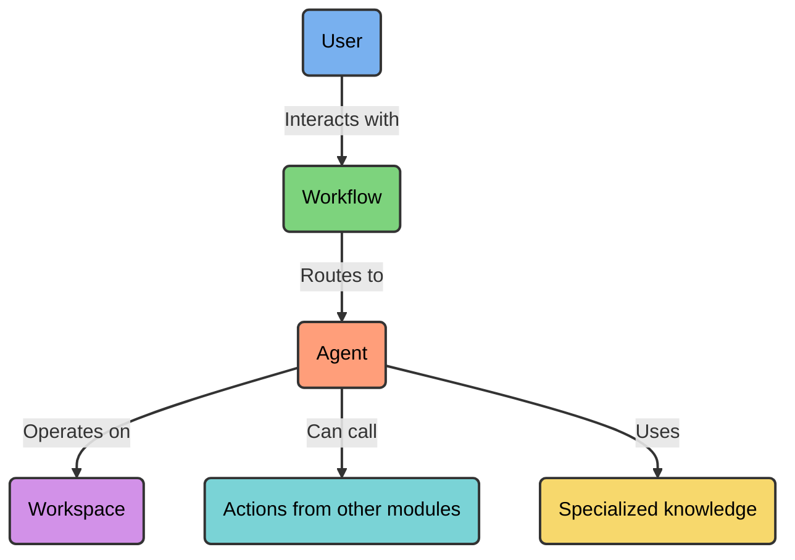
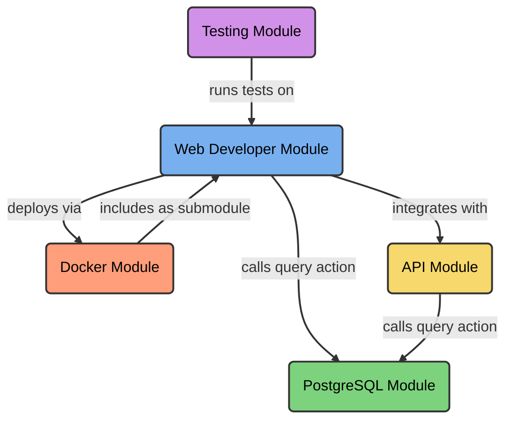
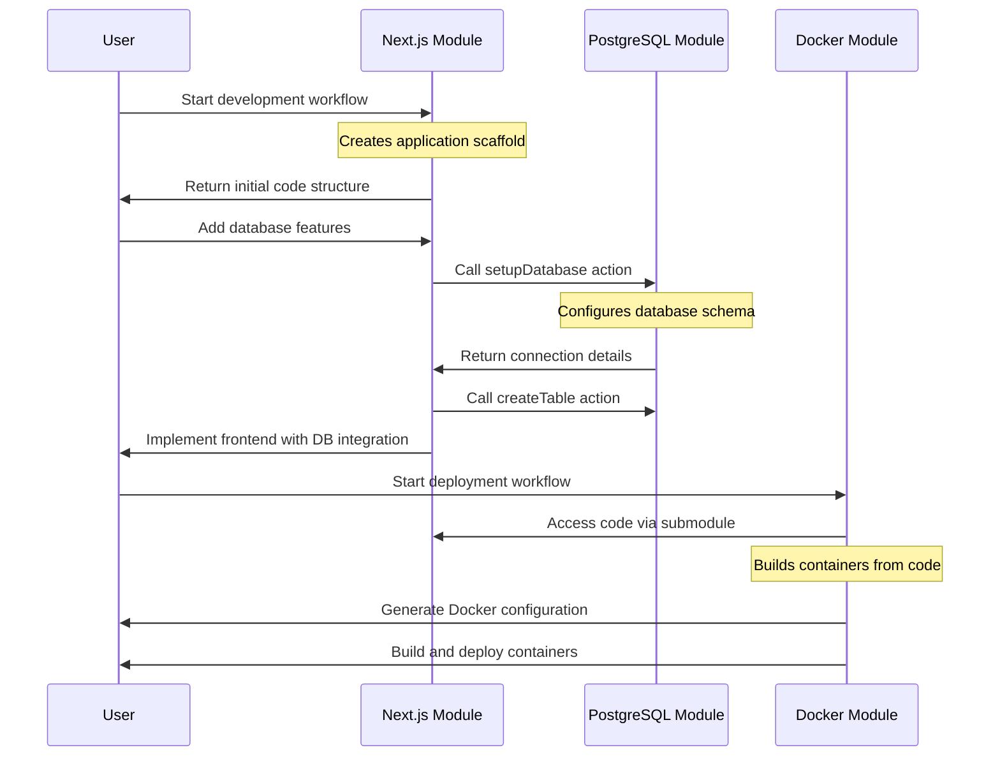

# Core Concepts

This document explains the key components that make up the Genbase platform. Understanding these concepts will help you effectively use the platform and develop your own modules.

## Modules

Modules are the building blocks of Genbase. Each module is a self-contained package that provides specialized functionality through intelligent agents.

Modules solve the balance between specialized knowledge and general capabilities. Instead of building a single agent that tries to know everything (but inevitably has limitations), Genbase lets you combine specialized modules that each excel in their domain.

> **Key Insight**: The power of Genbase comes from specialization and composition rather than trying to build one agent that does everything.

A module can:

- Implement specialized domain knowledge (web development, database management, DevOps)
- Define custom agents with deep expertise in specific tasks
- Expose actions that other modules can use
- Declare dependencies on other modules
- Provide purpose-built workflows for different user interactions

**Real-world example:** A PostgreSQL module contains deep knowledge of database administration, specialized SQL agents, and actions that allow other modules to execute optimized database queries.

## Agents

Agents are the intelligent assistants that power Genbase modules. Unlike generic AI assistants, Genbase agents have specialized knowledge and capabilities focused on specific domains.

Agents can:

- Generate and modify code with domain-specific expertise
- Access and manipulate files in a workspace
- Execute commands and scripts in their environment
- Communicate with users through purpose-built workflows
- Call actions from other modules to access specialized capabilities

**Example:** A Next.js agent understands not just React basics but Next.js-specific patterns, file organization, API routes, server components, and framework nuances that a general-purpose assistant might miss.

## Workflows

Workflows are how users interact with Genbase agents. They provide structured, purpose-built experiences for specific tasks instead of generic chat interfaces.

A workflow:

- Connects you to a specific agent with expertise in that workflow's domain
- Has clear instructions and context for a defined purpose
- Maintains conversation history and context
- Exposes specific actions you can trigger (like running tests or deploying code)
- Guides you through complex processes with domain-specific knowledge

**Practical example:** A Next.js module might offer different workflows for development, administration, and learning tasks, each tailored to the specific needs of that activity.

## Workspaces

Workspaces are Git repositories where agents operate. They provide:

- A complete filesystem that agents can read from and write to
- Version control tracking all changes
- A shared environment where multiple specialized agents can collaborate
- Persistent storage that maintains state between sessions

Unlike chat-based assistants where context is limited, workspaces maintain the full state of your project and allow agents to execute real commands and work with actual files.

## Relations

Relations define how modules can collaborate with each other, allowing specialized agents to work together seamlessly.

There are several types of relations:

- **Action Relations**: Allow one module to expose functions that other modules can call
- **Submodule Relations**: Allow one module to include another as a Git submodule in its workspace
- **Custom Relations**: Define other specialized ways modules can interact

**Example:** A web development module uses an action relation with a database module to execute queries without needing to understand database internals.

## Registry Kits

Registry kits are templates for creating modules available at registry.genbase.io. When you need to add a capability to your environment, you can use a kit that provides pre-configured modules with specialized agents.

A kit contains:

- A `kit.yaml` configuration file defining the module's structure
- Agent definitions with specialized instructions
- Workflow configurations for different use cases
- Dependency specifications and workspace configurations

> **Tip**: Use registry kits when you need to add specialized functionality that's outside your core expertise.

## Platform Architecture

The Genbase platform consists of two core components:

- **Engine**: The backend service that manages modules, agents, workspaces, and executes actions
- **Studio**: The user interface for interacting with workflows and managing modules

The Registry (registry.genbase.io) is an external service that hosts module kits.

## A Complete Example

Here's how these concepts work together in a real-world scenario:

In this example:

1. You interact with specialized modules for web development, database management, and deployment
2. Each module provides deep expertise in its domain
3. Modules collaborate through well-defined relations
4. The result is a complete system where specialized agents work together seamlessly

This modular approach makes Genbase powerful for complex development tasks where different types of expertise must work together effectively.