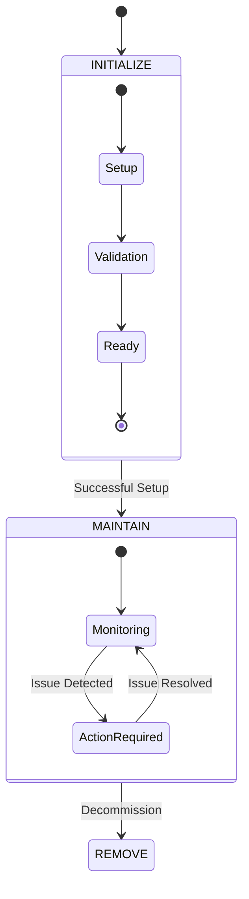
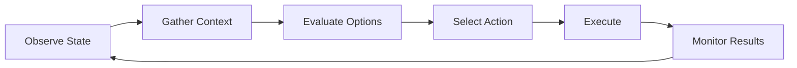

# Core Concepts

Hivon's architecture is built around several key concepts that work together to enable AI-controlled software systems. This page explores these concepts in detail, explaining how they interact and why they're essential.

## Architectural Overview

```mermaid
graph TB
    %% Define the foundational architecture of Hivon
    %% Show how different layers interact
    subgraph Registry Layer
        A[Kit Registry]
    end
    
    subgraph Module Layer
        B[Module Instance]
        C[Module Instance]
        D[Module Instance]
    end
    
    subgraph Control Layer
        E[AI Agent]
        F[AI Agent]
        G[AI Agent]
    end
    
    subgraph Integration Layer
        H[Software System]
        I[Software System]
        J[Software System]
    end
    
    A -->|Templates| B
    A -->|Templates| C
    A -->|Templates| D
    
    B -->|Controls| H
    C -->|Controls| I
    D -->|Controls| J
    
    E -->|Manages| B
    F -->|Manages| C
    G -->|Manages| D

## Kits: The Foundation

A kit in Hivon represents a template for AI-controlled software management. It defines how an AI agent should interact with and manage a specific type of software system.

### Kit Structure

```mermaid
graph TD
    subgraph Kit Components
        A[Kit Definition] --> B[Workflows]
        A --> C[Actions]
        A --> D[Instructions]
        A --> E[Resources]
        
        B --> B1[Initialize]
        B --> B2[Maintain]
        B --> B3[Remove]
        
        C --> C1[Python Functions]
        C --> C2[Shell Scripts]
        C --> C3[API Calls]
        
        D --> D1[Documentation]
        D --> D2[Specifications]
        D --> D3[Guidelines]
        
        E --> E1[Templates]
        E --> E2[Configs]
        E --> E3[Scripts]
    end
```

### Key Aspects of Kits

1. **Version Control**
   - Semantic versioning for predictable upgrades
   - Change tracking across versions
   - Backward compatibility guidelines

2. **Environment Specification**
   The kit defines all environmental requirements:
   ```yaml
   environment:
     - name: API_KEY
       description: "Authentication key for the service"
       required: true
       secret: true
     - name: SERVICE_URL
       description: "Base URL for API endpoints"
       required: true
       default: "https://api.service.com"
   ```

3. **Action Definitions**
   Actions are the primary interface between AI agents and software systems:
   ```python
   @action
   async def check_service_health(self, service_url: str) -> HealthStatus:
       """
       Check the health of the service endpoint.
       
       Args:
           service_url: The URL to check
           
       Returns:
           HealthStatus: Current health status with metrics
       """
       # Implementation
   ```

## Modules: The Implementation

Modules are instances of kits, representing actual software systems under AI control. Each module maintains its own:

### State Management
Modules implement a sophisticated state machine:



### Module Relationships

The relationship system enables modules to share context and operate together:

1. **Connection Relationships**
   - Bi-directional operational links
   - Shared workflows
   - Runtime dependencies
   ```python
   # Example of establishing a connection
   await module.create_relation(
       target_id="module-123",
       relation_type=RelationType.CONNECTION,
       description="Primary database connection"
   )
   ```

2. **Context Relationships**
   - Knowledge sharing
   - Configuration inheritance
   - Environmental awareness
   ```python
   # Example of context sharing
   shared_context = await module.get_context_from(
       source_id="module-456",
       context_type="configuration"
   )
   ```

## AI Agents: The Control Layer

AI agents in Hivon are specialized language models that:

### Tool Interaction
The agent uses a standardized tool interface:
```python
class Tool:
    name: str
    description: str
    parameters: Dict[str, Any]
    function: Callable
    
    async def execute(self, **params) -> Result:
        """Execute the tool with given parameters"""
```

### Context Building
Agents construct their understanding through:

1. Static Context
   - Module documentation
   - Workflow definitions
   - Historical patterns

2. Dynamic Context
   - Current state
   - Related module information
   - Environmental conditions
   - Recent actions and their outcomes

### Decision Making
The agent follows a structured decision process:



## Integration Points

Hivon provides several integration mechanisms:

### 1. API Integration
```python
from hivon import Module, Action

class CustomModule(Module):
    @Action
    async def integrate_with_service(self, endpoint: str):
        """Custom integration logic"""
        pass
```

### 2. Event System
```python
# Event subscription
@module.on_event("state_change")
async def handle_state_change(event: StateChangeEvent):
    """React to state changes"""
    pass
```

### 3. Plugin Architecture
```python
from hivon.plugins import Plugin

class CustomPlugin(Plugin):
    """Extend functionality through plugins"""
    
    async def initialize(self):
        """Plugin initialization"""
        pass
```

## Next Steps

1. Explore the [Quickstart Guide](/guides/quickstart) to create your first module
2. Learn about [Kit Development](/guides/creating-kits/basic-kit)
3. Understand [Module Management](/guides/using-modules/initialization)
4. Join our [Community](/community)