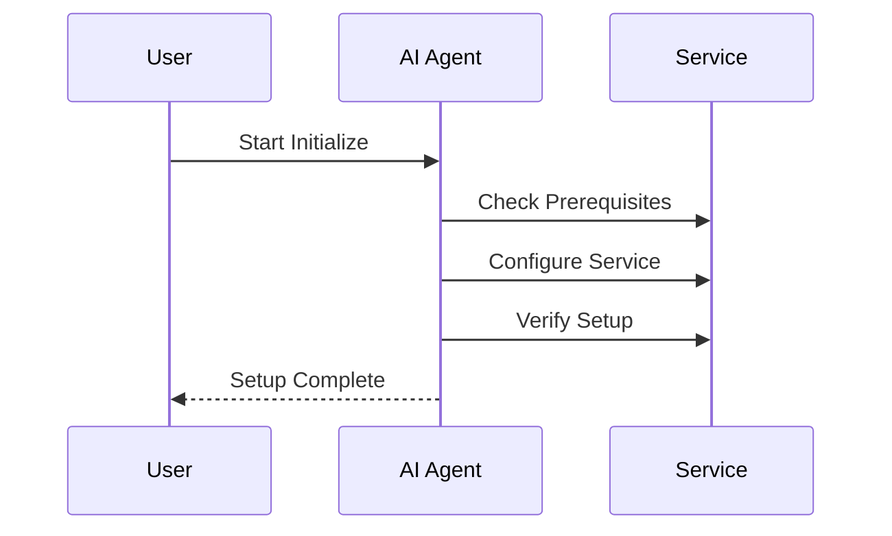

# Getting Started with Hivon

This guide will walk you through setting up your first AI-controlled module using Hivon. We'll create a simple module that manages a web service, demonstrating the core concepts and workflows.

## Prerequisites

Before starting, ensure you have:

1. Python 3.9 or higher installed
2. pip package manager
3. Git
4. A basic understanding of Python and web services

## Installation

First, let's install Hivon using pip:

```bash
pip install hivon-framework
```

Create a new directory for your project:

```bash
mkdir my-hivon-project
cd my-hivon-project
```

Initialize a new Hivon project:

```bash
hivon init
```

## Your First Module

Let's create a module that manages a web service. We'll use the web-service kit from the registry:

```bash
hivon module create --kit web-service --name my-service
```

This will create a new module with the following structure:

```
my-service/
├── actions/
│   ├── health.py
│   ├── deployment.py
│   └── monitoring.py
├── instructions/
│   ├── setup.md
│   └── maintenance.md
├── kit.yaml
└── workspace/
    ├── config/
    └── scripts/
```

### Configure the Module

Edit the module's environment variables:

```yaml
# .env
SERVICE_URL=https://api.example.com
API_KEY=your-api-key
ENVIRONMENT=production
```

## Understanding Module Workflows

### 1. Initialize Workflow

The initialize workflow sets up your service:



Start the initialization:

```bash
hivon workflow run my-service initialize
```

The AI agent will:
1. Check system requirements
2. Configure the service
3. Verify the setup
4. Move to the maintain stage

### 2. Maintain Workflow

In the maintain workflow, the agent monitors and manages your service:

```bash
hivon workflow run my-service maintain
```

Example interaction:

```
> Check the current status of the service

Agent: I'll check the service health and metrics.

Executing health check...
- Endpoint status: OK
- Response time: 145ms
- Error rate: 0.02%
- CPU usage: 45%

The service is running normally. Would you like me to:
1. Show detailed metrics
2. Optimize any settings
3. Set up alerts
```

## Adding Module Relationships

Let's connect our service module with a database module:

1. Create a database module:
```bash
hivon module create --kit postgresql --name my-database
```

2. Establish the connection:
```bash
hivon module connect my-service my-database --type connection
```

This enables:
- Shared context between modules
- Coordinated operations
- Automatic configuration updates

## Using the AI Agent

The AI agent can handle various tasks. Here are some example interactions:

### 1. Performance Optimization

```
> The service seems slow, can you optimize it?

Agent: I'll analyze the performance and make improvements.

1. Checking current metrics...
2. Analyzing bottlenecks...
3. Implementing optimizations...

I've made the following changes:
- Increased connection pool size
- Enabled response caching
- Optimized database queries

Response time has improved by 35%.
```

### 2. Configuration Management

```
> Update the service configuration for higher throughput

Agent: I'll adjust the configuration safely.

1. Backing up current config...
2. Analyzing resource usage...
3. Calculating optimal values...
4. Applying changes gradually...

Configuration updated:
- Worker processes: 8 -> 12
- Connection timeout: 30s -> 45s
- Max requests: 1000 -> 1500

Monitoring for any issues...
```

## Next Steps

Now that you have a basic module running, you can:

1. Explore [Advanced Module Configuration](/guides/using-modules/configuration)
2. Learn about [Custom Actions](/guides/creating-kits/actions)
3. Understand [Module Relationships](/concepts/modules/relationships)
4. Join the [Community](/community)

## Common Issues and Solutions

### Issue: Module Creation Fails

```bash
Error: Kit validation failed
```

Solution:
1. Verify kit name and version
2. Check environment variables
3. Ensure prerequisites are met

### Issue: Agent Communication Problems

```
Error: Could not execute workflow
```

Solution:
1. Check API access
2. Verify environment configuration
3. Review service permissions

## Getting Help

1. Documentation
   - [Concepts Guide](/concepts)
   - [API Reference](/reference/api)
   - [Troubleshooting Guide](/guides/troubleshooting)

2. Community
   - [Discord Server](https://discord.gg/hivon)
   - [GitHub Discussions](https://github.com/hivon/hivon/discussions)
   - [Stack Overflow](https://stackoverflow.com/questions/tagged/hivon)

Would you like me to continue with more documentation sections or expand any particular area?