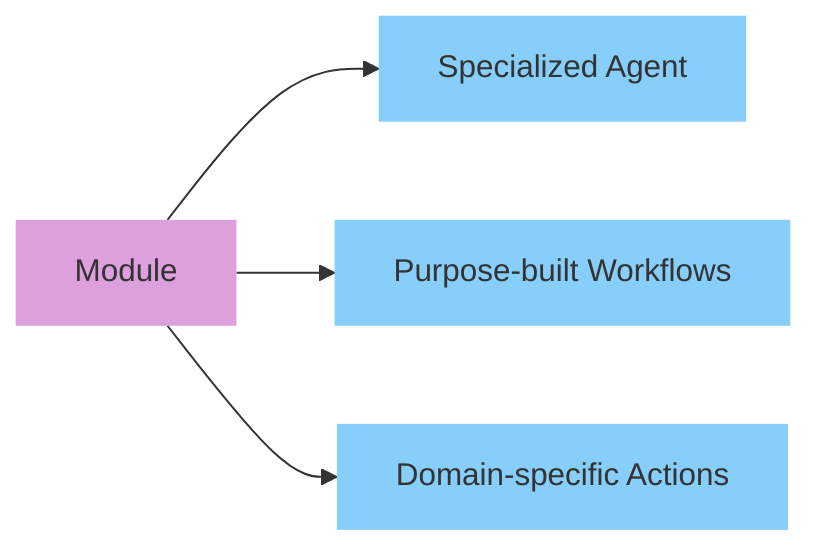
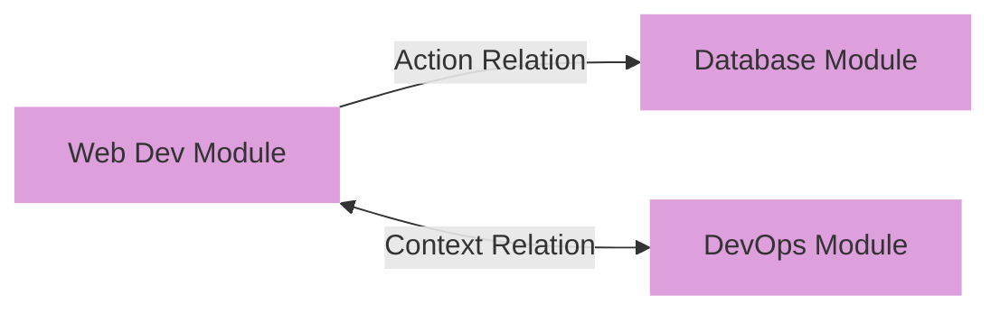

# Getting Started with Genbase

Welcome to Genbase! This guide will help you set up your environment and start building with specialized AI agents. Genbase makes it easy to create, combine, and deploy intelligent agents that collaborate to solve complex problems.

## What You'll Need

Before we begin, make sure you have:

- **Docker** and **Docker Compose** installed (for containerized deployment)
- At least one LLM API key (Anthropic, OpenAI, Groq, Mistral, or DeepSeek)
- Git (for cloning the repository)

## Quick Installation

The fastest way to get started is using Docker Compose:

```bash
# Clone the repository
git clone https://github.com/yourusername/genbase.git
cd genbase

# Copy environment templates
cp docker/.env.template docker/.env
cp engine/.env.template engine/.env
cp studio/.env.template studio/.env

# Edit .env files with your API keys and credentials
nano engine/.env  # Add at least one LLM API key here

# Make scripts executable
chmod +x scripts/*.sh

# Start Genbase
./scripts/docker-run.sh up
```

You can now access:
- **Studio** (frontend): http://localhost:5173
- **Engine** (API): http://localhost:8000

## Configuration Walkthrough

### Essential Environment Variables

The most important settings to configure are your LLM API keys. Open `engine/.env` and add at least one of:

```bash
# Choose at least one of these providers
ANTHROPIC_API_KEY=your_anthropic_key
OPENAI_API_KEY=your_openai_key
GROQ_API_KEY=your_groq_key
MISTRAL_API_KEY=your_mistral_key
DEEPSEEK_API_KEY=your_deepseek_key
```

### Default Login Credentials

By default, Genbase uses these credentials:
- **Username**: admin
- **Password**: password

To change them, update the following in your `docker/.env` file:

```bash
ADMIN_USERNAME=your_username
ADMIN_PASSWORD=your_secure_password
```

## First Steps with Genbase

Once you've started Genbase, follow these steps to begin:

### 1. Log into the Studio

Open http://localhost:5173 in your browser and log in with your credentials.

## 

### 2. Create Your First Project

Projects in Genbase organize your modules. Create one by:

1. Clicking "New Project" from the dashboard
2. Entering a name for your project (e.g., "My First Project")
3. Clicking "Create"

### 3. Add a Module from the Registry

Modules are the building blocks of Genbase. Let's add one:

1. Navigate to the "Registry" tab
2. Browse available modules
3. Select a module (e.g., "Next.js Web Developer")
4. Configure any required settings
5. Click "Add to Project"


### 4. Start Your First Workflow

Each module provides specialized workflows. To begin:

1. Return to your project
2. Find your newly added module
3. Click on the "Workflows" tab
4. Select a workflow (e.g., "Develop" for a development module)
5. Start chatting with the specialized agent!

## Understanding Genbase Components

To make the most of Genbase, it helps to understand its core components:

### Modules

Modules are self-contained packages with specialized agents, workflows, and actions. Each module focuses on a specific domain (web development, database administration, etc.).



### Workflows

Workflows are structured conversations with specialized agents. They guide you through specific tasks within a domain.

For example, a Next.js module might offer workflows for:
- Development (building features)
- Deployment (preparing for production)
- Learning (understanding Next.js concepts)

### Relationships

Modules become powerful when they work together. In Genbase, modules can form relationships:



- **Action Relations**: Allow one module to call specialized functions from another
- **Context Relations**: Enable sharing of information between modules
- **Submodule Relations**: Allow hierarchical nesting of modules

## Working with Multiple Modules

Let's create a simple web application with database integration:

1. Add a "Next.js Web Developer" module
2. Add a "PostgreSQL Administrator" module
3. Create an Action Relation between them
4. Use the Web Developer workflow to create features
5. When database functionality is needed, the web module can use PostgreSQL actions

This modular approach gives you specialized expertise in each domain.

## Common Commands

Here are some handy commands for managing your Genbase installation:

| Command | Description |
|---------|-------------|
| `./scripts/docker-run.sh up` | Start all services |
| `./scripts/docker-run.sh down` | Stop all services |
| `./scripts/docker-run.sh logs` | View logs |
| `./scripts/docker-run.sh restart` | Restart services |
| `./scripts/docker-run.sh build` | Rebuild images |

## Developing Your Own Modules

Once you're comfortable using existing modules, you might want to create your own:

1. Study the structure of existing modules
2. Create a new directory with the required components:
   - `kit.yaml`: Module configuration
   - `agents/`: Agent implementations
   - `actions/`: Module functions
   - `instructions/`: Prompts and guides
   - `workspace/`: Default files

The Registry provides templates to help you get started.

## Troubleshooting

If you encounter issues:

1. **Check logs**: `./scripts/docker-run.sh logs`
2. **Verify environment variables** are set correctly
3. **Ensure LLM API keys** are valid and have sufficient credits
4. **Restart services**: `./scripts/docker-run.sh restart`

## Next Steps

Congratulations on setting up Genbase! From here, you can:

- Explore more modules in the Registry
- Create relationships between your modules
- Learn to develop custom modules
- Check out the [Core Concepts](/docs/concepts) and [Architecture](/docs/architecture) documentation

For more advanced usage, see the full documentation on specialized workflows, module development, and agent customization.

Happy building with Genbase!