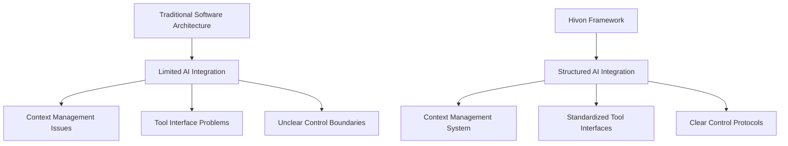
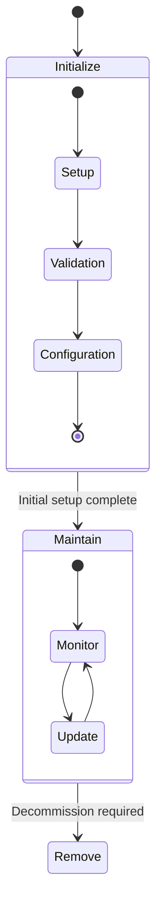

# Introduction to Hivon

Hivon represents a paradigm shift in software architecture, embracing the reality that while Artificial General Intelligence (AGI) remains on the horizon, we already possess AI models capable of human-level performance within well-defined domains. This framework bridges the gap between traditional software engineering and modern AI capabilities, offering a structured approach to building AI-controlled systems.

## The Challenge

Traditional software architecture faces several limitations when integrating with AI systems:

1. Context Integration
   Modern AI models excel with proper context, but there's no standardized way to provide and maintain this context in software systems.

2. Bounded Rationality
   While current AI models aren't generally intelligent, they perform exceptionally well within constrained environments with clear objectives.

3. Tool Integration
   AI models need well-defined interfaces to interact with software systems, but traditional architectures aren't designed with AI control in mind.

## The Hivon Solution

Hivon addresses these challenges through a comprehensive framework that enables:

### 1. Modular AI Control
The framework introduces the concept of AI-controlled modules, where each module:
- Represents a distinct software system or component
- Provides clear boundaries and interfaces
- Maintains its own context and state
- Operates through well-defined workflows

### 2. Contextual Awareness
Hivon's unique approach to context management ensures that:

Rather than relying on static prompts or one-size-fits-all solutions, Hivon enables dynamic context building through:
- Module relationships
- Shared resources
- Workflow history
- Environmental awareness

This context-first approach allows AI models to make informed decisions based on complete and relevant information.

### 3. Structured Workflows
The framework implements a stage-based workflow system that guides AI agents through different phases of module management:

## Key Benefits

### For Engineers
1. Structured Integration
   - Clear patterns for AI integration
   - Standardized interfaces
   - Predictable behavior

2. Reduced Complexity
   Engineers can focus on defining capabilities and constraints while letting AI handle routine operations.

3. Improved Maintainability
   The modular nature of Hivon allows for:
   - Isolated testing
   - Gradual adoption
   - Easy updates

### For Organizations
1. Scalable AI Integration
   Start small with individual modules and scale up as needed.

2. Risk Management
   - Clear boundaries for AI operations
   - Audit trails through workflow history
   - Controlled progression through stages

3. Resource Optimization
   AI agents can manage routine tasks efficiently, allowing human engineers to focus on strategic development.

## Real-World Applications

Hivon is particularly valuable in scenarios such as:

### DevOps Automation
AI agents can manage:
- Deployment workflows
- Monitoring and alerting
- Scaling decisions
- Incident response

### System Integration
Modules can represent different systems while AI agents handle:
- Data synchronization
- Protocol translation
- Error recovery
- Performance optimization

### Service Management
Automated management of:
- Service health
- Resource allocation
- Configuration updates
- Dependency management

## Next Steps

Begin your journey with Hivon by:

1. Understanding core concepts in the next section
2. Following the quickstart guide
3. Exploring the kit registry at registry.hivon.dev
4. Joining the community discussions

Each section of this documentation will dive deeper into specific aspects of Hivon, providing you with comprehensive knowledge to successfully implement AI-controlled software architectures.